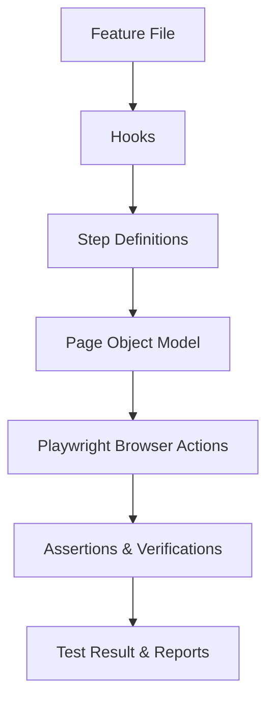

# BDD Test Automation with Playwright & Cucumber

## Overview

This repository demonstrates **Behavior-Driven Development (BDD)** using **Playwright** for automation and **Cucumber.js** for scenario management. The project implements a structured, maintainable, and readable automation framework for web applications, using **Page Object Model (POM)** for reusable components and **Cucumber step definitions** for clear business-level scenarios.

---

## What is BDD?

**Behavior-Driven Development (BDD)** is an agile software development approach that emphasizes **collaboration between developers, testers, and business stakeholders**.

Instead of focusing purely on code or technical implementation, BDD focuses on **defining application behavior in plain language**, which is understandable by all team members. This ensures everyone is aligned with the business goals.

Key concepts:

- **Feature Files:** Written in **Gherkin**, describing scenarios in `Given-When-Then` format.
- **Step Definitions:** Maps each step in the feature file to executable code.
- **Living Documentation:** Scenarios serve as both documentation and automated tests.

---

## Why BDD is Important

1. **Collaboration:** Encourages communication between technical and non-technical stakeholders.
2. **Clarity:** Ensures requirements are clearly defined and understood by the whole team.
3. **Automation Ready:** BDD scenarios can be directly automated, reducing gaps between requirements and implementation.
4. **Maintainable Tests:** Using POM, tests are modular and easier to maintain.
5. **Business Value Focused:** Validates that software behaves **exactly as expected from a business perspective**, not just technically.

---

## Project Structure

```
bdd-pattern/
├── cucumber.cjs                  # Cucumber.js configuration
├── features/                     # Feature files in Gherkin syntax
│   ├── basic/
│   │   └── login.feature
│   └── pom/
│       └── loginPom.feature
├── step-definations/             # Step definition files
│   ├── basic/
│   │   └── basicLoginSteps.js
│   └── pom/
│       └── pomPage.js
├── page-objects/                 # Page Object Models
│   └── loginPage.js
├── support/                      # Hooks and setup (Before/After)
│   └── hooks.js
├── reports/                      # JSON and HTML test reports
├── package.json
├── package-lock.json
└── node_modules/
```

---

## Example Feature File

**`features/basic/login.feature`**

```gherkin
Feature: User Login
    @basic
    Scenario: Login with valid credentials
        Given the user is on the login page
        When the user enter valid credentials
        Then the dashboard page appears
```

This scenario describes a successful login using plain language understandable by all stakeholders.

---

## Example Step Definitions

**`step-definations/pom/pomPage.js`**

```javascript
import { Given, When, Then } from "@cucumber/cucumber";
import { expect } from "@playwright/test";
import { LoginPage } from "../../page-objects/loginPage.js";

let loginPage;

Given("the user is on login page", async function () {
  loginPage = new LoginPage(this.page);
  await loginPage.goto("https://www.saucedemo.com/");
});

When("the user enter valid credentials", async function () {
  await loginPage.signIn("standard_user", "secret_sauce");
});

Then("the dashboard page appears", async function () {
  await expect(this.page).toHaveURL("https://www.saucedemo.com/inventory.html");
  await expect(loginPage.getHeader()).toHaveText("Swag Labs");
});
```

---

## Page Object Model (POM) Example

**`page-objects/loginPage.js`**

```javascript
export class LoginPage {
  constructor(page) {
    this.page = page;
    this.usernameInput = page.locator("#user-name");
    this.passwordInput = page.locator("#password");
    this.loginButton = page.locator("#login-button");
    this.header = page.locator(".app_logo");
  }

  async goto(url) {
    await this.page.goto(url);
  }

  async signIn(username, password) {
    await this.usernameInput.fill(username);
    await this.passwordInput.fill(password);
    await this.loginButton.click();
  }

  getHeader() {
    return this.header;
  }
}
```

This class encapsulates all login page actions and locators, promoting **reusability and readability**.

---

## Hooks

**`support/hooks.js`**

```javascript
import { chromium } from "@playwright/test";
import { Before, After } from "@cucumber/cucumber";

let browser;

Before(async function () {
  browser = await chromium.launch({ headless: false });
  const context = await browser.newContext();
  this.page = await context.newPage();
});

After(async function () {
  await this.page.close();
  await browser.close();
});
```

Hooks ensure **browser setup and teardown** is consistent across all scenarios.

---

## Running Tests

1. Install dependencies:

```bash
npm install
```

2. Run all tests with Cucumber:

```bash
npx cucumber-js
```

3. Run tests by tag:

```bash
npx cucumber-js --tags @basic
npx cucumber-js --tags @pom
```

4. Generate JSON report:

Configured in `cucumber.cjs`:

```javascript
module.exports = {
  default: `
  --require ./support/**/*.js
  --require ./step-definations/**/*.js
  --format json:./reports/cucumber.json
  ./features/**/*.feature`,
};
```

---

### BDD Test Execution Flow



---

## Key Takeaways

- **BDD + Cucumber + Playwright** allows bridging **business requirements** with **automated tests**.
- **Gherkin feature files** make scenarios readable and collaborative.
- **POM** ensures your tests are modular and maintainable.
- Hooks ensure clean **setup and teardown** for consistent test runs.
- Reports provide insight into test execution for **stakeholders and developers**.
