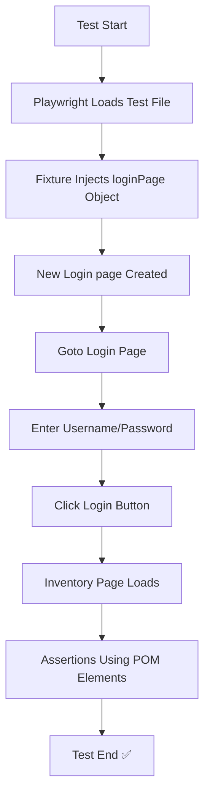

## ✅ Playwright Design Patterns — ⚙ Fixtures + 🧩 Page Object Model (POM)

This page demonstrates **scalable Playwright automation architecture** using:

- ✅ **Fixtures Pattern** → Provides test-ready objects (e.g., logged-in page, POM instances)
- ✅ **Page Object Model (POM)** → Improves maintainability with reusable UI interaction classes

---

## 📂 Project Structure

```
design-patterns/
├── .gitignore
├── fixtures-pattern/ (other examples)
├── pom-pattern/
│   ├── fixtures/
│   │   └── login-fixture.js
│   ├── page-objects/
│   │   └── login.js
│   ├── playwright-report/
│   ├── playwright.config.ts
│   ├── tests/
│   │   ├── basicTest.spec.ts
│   │   ├── pomFixture.spec.ts
│   │   └── pomTest.spec.ts
│   └── package.json
├── node_modules/
├── package-lock.json
├── README.md
```

✅ The `pom-pattern` folder is the working automation project where tests are executed
✅ Tests run from inside: `design-patterns/pom-pattern/`

---

## 🧩 What Are Fixtures in Playwright?

Fixtures are a **powerful dependency injection system**.
They **set up and provide reusable context** for your tests.

✅ Example benefits:

| Without Fixture                      | With Fixture                            |
| ------------------------------------ | --------------------------------------- |
| Duplicate setup in every test        | Single, centralized setup               |
| Hard to maintain                     | Highly maintainable & readable          |
| Can’t enforce login or preconditions | Auto-login, environments pre-configured |

Fixtures help **engineer quality**, not just test it ✅

## 🧱 Why Fixtures Matter

| Feature                      | Benefit                         |
| ---------------------------- | ------------------------------- |
| Dependency injection         | Eliminates repeated setup       |
| Centralized configuration    | One change applied to all tests |
| Automatic lifecycle handling | Cleaner test code               |
| Produces reusable objects    | e.g., a logged-in user          |

---

## ✅ Custom Fixture Example (Your Implementation)

📌 `pom-pattern/fixtures/login-fixture.js`

```js
import { test as base } from "@playwright/test";
import { Login } from "../page-objects/login";

export const test = base.extend({
  loginPage: async ({ page }, use) => {
    const loginPage = new Login(page);
    await use(loginPage);
  },
});

export const expect = base.expect;
```

✅ This fixture makes a `loginPage` POM instance available to any test
✅ Enables clean & readable test code
✅ Now any test can call loginPage directly — no repeated code
✅ Keeps business logic inside POM (not test files)

---

## 🧱 Page Object Model (POM)

📌 `pom-pattern/page-objects/login.js`

```js
export class Login {
  constructor(page) {
    this.page = page;
    this.usernameInput = page.locator("#user-name");
    this.passwordInput = page.locator("#password");
    this.loginButton = page.locator("#login-button");
    this.header = page.locator(".app_logo");
  }

  async goto() {
    await this.page.goto("/");
  }

  async signIn(username, password) {
    await this.usernameInput.fill(username);
    await this.passwordInput.fill(password);
    await this.loginButton.click();
  }

  getHeader() {
    return this.header; // return Locator => Perfect for Assertions ✅
  }
}
```

Benefits:

- ✅ UI locator changes only in one place
- ✅ Promotes readability, maintainability, and reusability

---

## ✅ Tests Using Different Approaches

### 1️⃣ Basic Test (No POM, No Fixture)

📌 `pom-pattern/tests/basicTest.spec.ts`

```ts
import { test, expect } from "@playwright/test";

test("Basic Test", async ({ page }) => {
  await page.goto("/");
  await expect(page).toHaveTitle("Swag Labs");
  await page.locator("#user-name").fill("standard_user");
  await page.locator("#password").fill("secret_sauce");
  await page.locator("#login-button").click();
});
```

✅ Works fine
📌 ❌ Harder to maintain long-term

---

### 2️⃣ Test Using POM + Fixture (Best Pattern)

📌 `pom-pattern/tests/pomFixture.spec.ts`

```ts
import { test, expect } from "../fixtures/login-fixture";

test("Login as standard user using POM + Fixture", async ({
  page,
  loginPage,
}) => {
  await loginPage.goto();
  await loginPage.signIn("standard_user", "secret_sauce");

  await expect(page).toHaveURL("https://www.saucedemo.com/inventory.html");
  await expect(loginPage.getHeader()).toHaveText("Swag Labs");
});
```

✅ Clean
✅ Reusable
✅ Fully scalable
📌 Best industry practice ✅

---

### 3️⃣ POM Only (without fixture)

📌 `pom-pattern/tests/pomTest.spec.ts`

```ts
import { test, expect } from "@playwright/test";
import { Login } from "../page-objects/login";

test("Login as standard user using POM", async ({ page }) => {
  const login = new Login(page);
  await login.goto();
  await login.signIn("standard_user", "secret_sauce");
  await expect(login.getHeader()).toHaveText("Swag Labs");
});
```

✅ Simple POM example
📌 Manual object creation in every test

### ▶️ Execution Flow — Visualized



## 🚀 Running Tests

```bash
cd design-patterns/pom-pattern
npm install
npx playwright test --headed
```

📌 Reports will be available in:

```
pom-pattern/playwright-report/index.html
```

---

## 🏁 Summary

| Feature                                        | Why It Matters in Industry                         |
| ---------------------------------------------- | -------------------------------------------------- |
| Fixtures                                       | Ensures reusable setup, reduces dependency clutter |
| POM                                            | Separates test logic from UI interactions          |
| Scalability                                    | Easy onboarding for new team members               |
| Clean folder structure                         | Faster debugging + improved coverage scalability   |
| Demonstrates real-world automation engineering | Not just testing — building frameworks ✅          |

---

## ✅ Takeaway

> **This project shows understanding of framework design — not just writing tests.**
